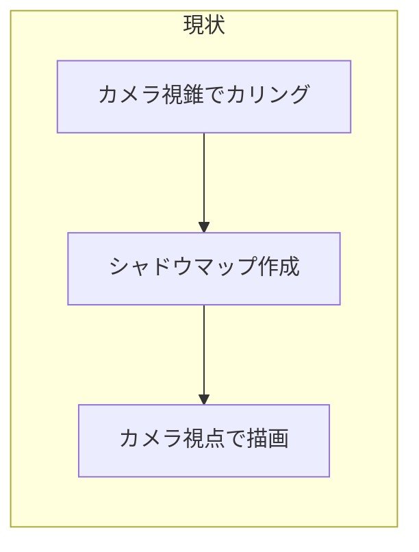

# Cesium 影表示の現状・原因・対応方法

## 1. はじめに・目的

日時に応じて建物の影がどう落ちるかを試せることは、建設業における建物設計の検討に活用できる。本資料では、Cesium を用いた影表示について、現状の制約（問題）・技術的な原因・対応方法を整理する。今後の実装方針や Cesium 内部改修の判断材料とすることを目的とする。

---

## 2. 現状の問題

### 問題 A: 太陽を背にした視点で影が消える／欠ける

- カメラが太陽の方向を向いているときは、建物の影が地面に正しく見える。
- カメラが太陽を背にすると、影が表示されない、または欠けて見える。
- 想定ユースでは「任意の視点で影を見たい」ため、厳しい制約となる。

### 問題 B: 視野外の地形が建物に落とす影（山陰など）が表現されない

- カメラの背後にある山など、視野外の地形が建物や地面に落とす影が描画されない。
- 現実には山陰になるような場所でも、影が付かない。

---

## 3. 原因（技術的な理由）

### 共通の根本原因: シャドウマップ作成時のカリングがカメラ視錐台ベース

影の描画フローは次のとおりである。

1. **シャドウマップ** = 太陽から見た深度マップ（太陽視点でシーンを描画し、深度をテクスチャに記録したもの）。
2. **本番描画** = カメラ視点で描画しつつ、各ピクセルでシャドウマップを参照し「影なら暗くする」判定を行う。

Cesium では、**シャドウマップを作成するときの「何を描き込むか」の判定に、カメラの視錐台（しすいだい）が使われている**。その結果、次のようになる。

| 問題 | メカニズム |
|------|------------|
| 問題 A | 太陽を背にすると、影を落とすべき建物・地形がカメラの背後にあり、シャドウマップに含まれない → 影が消える。 |
| 問題 B | 山などがカメラの背後にあると、シャドウマップに含まれない → 山陰が描画されない。 |

現状の流れを図示すると以下のとおりである。

---

## 4. 対応方法

### 4.1 シャドウマップ作成時のカリングを「影に影響するか」で行う（根本対応）

シャドウマップ作成時、カメラの視錐台ではなく **光（太陽）の視錐** および **影を受けたい領域** を基準に描画対象を決める。

- **効果**: 視野外の地形（山など）もシャドウマップに含まれる → 問題 B（山陰）が解消する。
- **必要作業**: Cesium 内部の変更（シャドウマップ用のカリング基準の変更）。

### 4.2 シャドウマップの保持・再利用（太陽を背にした視点での影表示）

- 影が出る視点（太陽を向いているとき）で作成したシャドウマップを保持する。
- 影が出ない視点では、その保持したシャドウマップを参照して影を表示する。
- 太陽の位置が同じなら「どの物体がどこに影を落とすか」は視点に依存しないため、理論的に成立する。

**注意**: 4.1 を実施しない場合、保持するシャドウマップにもともと山などが含まれていないため、山陰は出ない。4.1 と組み合わせると、問題 A と問題 B の両方の制約を緩和できる。

### 4.3 UI による案内（緩やかな対策）

- 太陽を背にしているときに「影をはっきり見るには太陽方向を向いてください」等のメッセージを表示する。
- 太陽方向への回転ボタンや、日時に対応した「おすすめ視点」の提案を行う。
- 根本解決ではないが、運用で補う場合の選択肢となる。

---

## 5. 補足（現行プロジェクトの設定）

本プロジェクトの Cesium 影まわり設定は [src/viewer.js](src/viewer.js) で行っている。主な設定は以下のとおりである。

- シーン: `shadows: true`, `terrainShadows: C.ShadowMode.ENABLED`
- グローブ: `enableLighting: true`, `depthTestAgainstTerrain: true`, `requestVertexNormals: true`（地形）
- シャドウマップ: `shadowMap.maximumDistance = 1000.0`, `shadowMap.size = 4096`（`softShadows` はコメントアウトで無効）
- 3D Tiles（建物）: `Cesium3DTileset` は `shadows` 未指定のためデフォルトの `ShadowMode.ENABLED`
- 日時: `viewer.clock.currentTime` で制御。太陽位置は Cesium が日時（JulianDate）から計算している。

---

## 6. まとめ・今後の検討

- 問題 A・B はどちらも「シャドウマップ作成時のカメラ視錐カリング」に起因する。
- 根本対応は、シャドウマップを「光視錐・影の影響範囲」で構築するよう Cesium を変更することである。
- その上でシャドウマップの保持・再利用を行うと、太陽を背にした視点でも影を表示可能になる。
- 山陰を含めた正確な影表示には、4.1 のカリング基準変更が不可欠である。

### 参照

- Cesium Shadows Roadmap: [CesiumGS/cesium#2594](https://github.com/CesiumGS/cesium/issues/2594)
